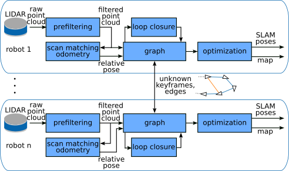

# Multi-Robot Graph SLAM using LIDAR

This repository contains a ROS2 multi-robot 3D LIDAR SLAM system based on the [hdl_graph_slam](https://github.com/koide3/hdl_graph_slam) package. The system is tested on ROS2 `Humble` and `Jazzy` and it is actively developed. It is designed to work with multiple robots, each equipped with a 3D LIDAR sensor and each robot running its own instance of the SLAM algorithm. Each robot can share its graph with other robots, allowing for a collaborative SLAM approach. The system is capable of handling loop closures, can save and load graphs, and save maps.

Check out a video of the system in action on YouTube:
<a href="https://www.youtube.com/watch?v=wFmfrwv5CcU&t=3s&ab_channel=AndreasSerov" title="Multi-Robot Graph SLAM using LIDAR">
  
</a>

## Table of Contents

- [Multi-Robot Graph SLAM using LIDAR](#multi-robot-graph-slam-using-lidar)
  - [Table of Contents](#table-of-contents)
  - [Overview](#overview)
  - [Dependencies](#dependencies)
  - [Installation](#installation)
  - [Docker Installation](#docker-installation)
  - [Usage](#usage)
    - [Usage with a namespace / robot name](#usage-with-a-namespace--robot-name)
    - [Usage without a namespace / robot name](#usage-without-a-namespace--robot-name)
    - [Usage with online point cloud data](#usage-with-online-point-cloud-data)
  - [Usage Docker](#usage-docker)
  - [Playback ROS2 demo bag](#playback-ros2-demo-bag)
  - [Simulation](#simulation)
  - [Visualization](#visualization)
  - [Saving the Graph](#saving-the-graph)
  - [Loading the Graph](#loading-the-graph)
  - [Saving the Map](#saving-the-map)
  - [Running mrg\_slam with a pre-built map](#running-mrg_slam-with-a-pre-built-map)
  - [Citation](#citation)
  - [Changelog](#changelog)

## Overview

The repositories that will be cloned with the vcs tool are:

- [mrg_slam](https://github.com/aserbremen/mrg_slam) - Multi-Robot Graph SLAM ROS2 package based on hdl_graph_slam
- [mrg_slam_msgs](https://github.com/aserbremen/mrg_slam_msgs) - ROS2 message interfaces for mrg_slam
- [mrg_slam_sim](https://github.com/aserbremen/mrg_slam_sim) - Gazebo simulation for mrg_slam for testing purposes
- [small_gicp](https://github.com/koide3/small_gicp) - Point cloud registration library, successor of fast_gicp
- [fast_gicp](https://github.com/SMRT-AIST/fast_gicp) - Fast GICP library for scan matching, kept for GPU-based scan matching
- [ndt_omp](https://github.com/koide3/ndt_omp) - Normal Distributions Transform (NDT) library for scan matching

The system is described in detail in the [paper](https://ieeexplore.ieee.org/document/10553070) titled "Multi-Robot Graph SLAM using LIDAR". The processing pipeline follows the following diagram:


Feel free to open an issue if you have any questions or suggestions.

## Dependencies

- OpenMP
- PCL
- g2o
- suitesparse

The following ROS packages are required:

- geodesy
- nmea_msgs
- pcl_ros

## Installation

We use the vcs tool to clone the repositories. If you have ROS2 installed, you should be able to `sudo apt install python3-vcstool`. If not check out the [vcstool installation guide](https://github.com/dirk-thomas/vcstool?tab=readme-ov-file#how-to-install-vcstool). Then run the following commands: 

```
git clone https://github.com/aserbremen/Multi-Robot-Graph-SLAM
cd Multi-Robot-Graph-SLAM
mkdir src
vcs import src < mrg_slam.repos
rosdep install --from-paths src --ignore-src -r -y
colcon build --symlink-install
source install/setup.bash
```

On memory limited systems, you need to export the MAKEFLAGS `export MAKEFLAGS="-j 2"` to limit the maximum number of threads used for a specific package using `make`. Then, use `colcon build --symlink-install --parallel-workers 2 --executor sequential`.

## Docker Installation

The docker user has the id and gid 1000 (default linux user) and is called `ubuntu`. If you experience issues seeing the topics from the docker container, you might need to change the user id in the Dockerfile to your user id.

The `mrg_slam` Docker is manually built and pushed to the my [Docker Hub](https://hub.docker.com/u/aserbremen). I added a successful docker build for `arm64` platforms starting with version `1.2.0`, let me know if it works on your arm machine. To pull the docker image, run the following command:

```
docker pull aserbremen/mrg_slam_humble # for ROS2 humble
docker pull aserbremen/mrg_slam_jazzy # for ROS2 jazzy
```

In order to build your local workspace into a docker container, including your own code/changes, you can run the following command:

```
cd Multi-Robot-Graph-SLAM
docker build -f docker/humble_local/Dockerfile -t mrg_slam . # for ROS2 humble
docker build -f docker/jazzy_local/Dockerfile -t mrg_slam . # for ROS2 jazzy
```

You should be able to communicate with the docker container from the host machine, see Usage section below.

## Usage

:information_source: If you use `mrg_slam` on real robots, I strongly recommend using the ROS2 Jazzy version and [rmw_zenoh](https://github.com/ros2/rmw_zenoh) as the middleware. I have performed tests with two rovers using ROS2 Humble + DDS or ROS2 Jazzy + DDS, and communication between the `mrg_slam` nodes repeatedly failed. The `rmw_zenoh` middleware under ROS2 Jazzy has shown to be reliable in this context.  

For more detailed information on the SLAM components check out the README.md of the [mrg_slam](https://github.com/aserbremen/mrg_slam) package.

The SLAM can be launched using the default config file [config/mrg_slam.yaml](https://github.com/aserbremen/mrg_slam/blob/main/config/mrg_slam.yaml) of the `mrg_slam` package with the following command:

```
ros2 launch mrg_slam mrg_slam.launch.py
```

### Usage with a namespace / robot name

Launch the SLAM node with the command below. The parameter `model_namespace` is going to be used to namespace all the topics and services of the robot. Additionally, the initial pose in the map frame `x`, `y`, `z`, `roll`, `pitch`, `yaw` (radians) can be supplied via the command line. Check out the launch file [mrg_slam.launch.py](https://github.com/aserbremen/mrg_slam/blob/main/launch/mrg_slam.launch.py) and the config file [mrg_slam.yaml](https://github.com/aserbremen/mrg_slam/blob/main/config/mrg_slam.yaml) for more parameters. The main point cloud topic necessary is `model_namespace/velodyne_points`. Per Default the model namespace is `atlas` and `use_sim_time` is set to `true`:

```
ros2 launch mrg_slam mrg_slam.launch.py model_namespace:=atlas x:=0.0 y:=0.0 z:=0.0 roll:=0.0 pitch:=0.0 yaw:=0.0
```

### Usage without a namespace / robot name

Many packages use hard-coded frames such as `odom` or `base_link` without a namespace. If you want to run the SLAM node without a namespace, you need to set the `model_namespace` to an empty string in the [mrg_slam.yaml](https://github.com/aserbremen/mrg_slam/blob/main/config/mrg_slam.yaml) file. Note that you can't pass an empty string as the `model_namespace` via the command line, so you must to set it directly in the configuration. Then, you can launch the SLAM node with the following command:

```
ros2 launch mrg_slam mrg_slam.launch.py x:=0.0 y:=0.0 z:=0.0 roll:=0.0 pitch:=0.0 yaw:=0.0
```

During visualization for naming the keyframes, the robot name will be displayed as `""` if no namespace is set.

## Usage Docker

If you want to run the SLAM node inside a docker container, make sure that the docker container can communicate with the host machine. For example, environment variables like ROS_LOCALHOST_ONLY or ROS_DOMAIN_ID should not set or should be correctly set on the host and docker system. 

Checkout the docker compose file: [compose.yaml](docker/compose.yaml). The docker compose binds the [mrg_slam.yaml](https://github.com/aserbremen/mrg_slam/blob/main/config/mrg_slam.yaml) config and the [mrg_slam.launch.py](https://github.com/aserbremen/mrg_slam/blob/main/launch/mrg_slam.launch.py) launch file of your local workspace, i.e. your `src` folder. 

```
cd docker
docker compose up
```

## Playback ROS2 demo bag

I have supplied a demo bag file for testing purposes which can be downloaded from [here](https://drive.google.com/drive/folders/1sJw0ma0IINBS9GIBQdGMfNJGs2d4TF9U?usp=sharing). The bag file contains the data of two robots `atlas` and `bestla` moving in the simulated marsyard environment, demonstrated in the video above. Note that the bags are not exactly the same as in the video, but they are similar❕ The topics are as follows:

- `/atlas/velodyne_points`
- `/atlas/cmd_vel`
- `/atlas/imu/data` # not used in the SLAM node but given for reference
- `/atlas/odom_ground_truth`
- `/bestla/velodyne_points`
- `/bestla/cmd_vel`
- `/bestla/imu/data` # not used in the SLAM node but given for reference
- `/bestla/odom_ground_truth`
- `/clock`

Note that you need two instances of the SLAM algorithm for `atlas` and `bestla`. The initial poses need to be given roughly. You should end up with a similar looking result as demonstrated in the youtube video.

```
ros2 launch mrg_slam mrg_slam.launch.py model_namespace:=atlas x:=-15 y:=13.5 z:=1.2 # terminal 1 for atlas
ros2 launch mrg_slam mrg_slam.launch.py model_namespace:=bestla x:=-15 y:=-13.0 z:=1.2 # terminal 2 for bestla
```

To play the bag file, run the following command:

```
ros2 bag play rosbag2_marsyard_dual_robot_demo
```

## Simulation

Alternatively to playing back the ROS2 bag, you can simulate a gazebo environment and test the multi-robot SLAM manually. Check out the repository [mrg_slam_sim](https://github.com/aserbremen/mrg_sim) for testing out the multi-robot SLAM implementation in a simulated environment using Gazebo (tested on Fortress and Harmonic). Note that this approach might need a bit more computational resources than the playback of the rosbag.

## Visualization

Visualize the SLAM result with the following command. The rviz configuration is configured for the robot names `atlas` and `bestla`:    

```
rviz2 -d path/to/mrg_slam/rviz/mrg_slam.rviz
```

## Saving the Graph

Save the graph of the robot `atlas` to a directory for inspection with the following command:

```
ros2 service call /atlas/mrg_slam/save_graph mrg_slam_msgs/srv/SaveGraph "{directory: /path/to/save}"
```

The directory will contain a `keyframes` folder with detailed information about the keyframes and a `.pcd` per keyframe. The `edges` folder contains `.txt` files with the edge information. Additionally, the `g2o` folder contains the g2o graph files. 

## Loading the Graph

The graph can be loaded from the directory which was previously saved with the `save_graph` service call. The graph is loaded into the SLAM node and the unique IDs of the keyframes are used to only add unknown keyframes to the graph. 
For the robot name `atlas`:

```
ros2 service call /atlas/mrg_slam/load_graph mrg_slam_msgs/srv/LoadGraph "{directory: /path/to/load}"
```

Note that loaded keyframes when visualized have a certain string added to the name to distinguish them from the keyframes that were added during the SLAM process. Right now `(loaded)` is added to the name of the keyframe.

## Saving the Map

Save the map of the robot `atlas` to a `.pcd` file. If no resolution is given, the full resolution map is saved. Otherwise a voxel grid map with the given resolution is saved. Note that in comparison to the `save_graph` service call, the full `file_path` needs to be given.

```
ros2 service call /atlas/mrg_slam/save_map mrg_slam_msgs/srv/SaveMap "{file_path: /path/to/save/map.pcd, resolution: 0.1}"
```

Inspect the map with the pcl_viewer `pcl_viewer /path/to/save/map.pcd`.

## Running mrg_slam with a pre-built map

If you have a pre-built map (`.pcd` file), you can use the `mrg_slam_static_keyframe_provider` package to provide keyframes to the SLAM instances. Check out the pagacke [mrg_slam_static_keyframe_provider](https://github.com/aserbremen/mrg_slam_static_keyframe_provider) for more information.

## Citation

If you use this package in your research, please cite the following [paper](https://ieeexplore.ieee.org/document/10553070):

```
@INPROCEEDINGS{Serov2024ICARA,
  title={Multi-Robot Graph SLAM Using LIDAR}, 
  author={Serov, Andreas and Clemens, Joachim and Schill, Kerstin},
  booktitle={2024 10th International Conference on Automation, Robotics and Applications (ICARA)}, 
  year={2024},
  Address = {Athens, Greece},
  doi={10.1109/ICARA60736.2024.10553070}
}
```
## Changelog

- 2025-08-07: Version 1.3.0 refactored `mrg_slam` to dynamically use most ROS2 parameters instead of setting member variables in the class during initialization. Simplified and removed unused code.
- 2025-04-23: Added `arm64` Docker support to the Docker images hosted on https://hub.docker.com/repositories/aserbremen. 
- 2025-01-07: Added ROS2 Jazzy Dockerfiles to this repository and images to the Docker Hub.
- 2024-12-09: Introduced unique IDs (`boost::uuids::uuid`) for each SLAM instance, which are generated at the start of the SLAM node. Reworked loop closure detection to properly consider candidates when loading and exchanging graphs between SLAM instances.
- 2024-12-09: Started manually tagging the [docker containers](https://hub.docker.com/r/aserbremen/mrg_slam) with (1.0.0). 
- 2024-11-12: Added [small_gicp](https://github.com/koide3/small_gicp) as a successor of [fast_gicp](https://github.com/koide3/fast_gicp) to Multi-Robot Graph SLAM 
- 2024-11-06: Added the `mrg_slam_static_keyframe_provider` package to provide keyframes to the SLAM instances, see [mrg_slam_static_keyframe_provider](https://github.com/aserbremen/mrg_slam_static_keyframe_provider)
